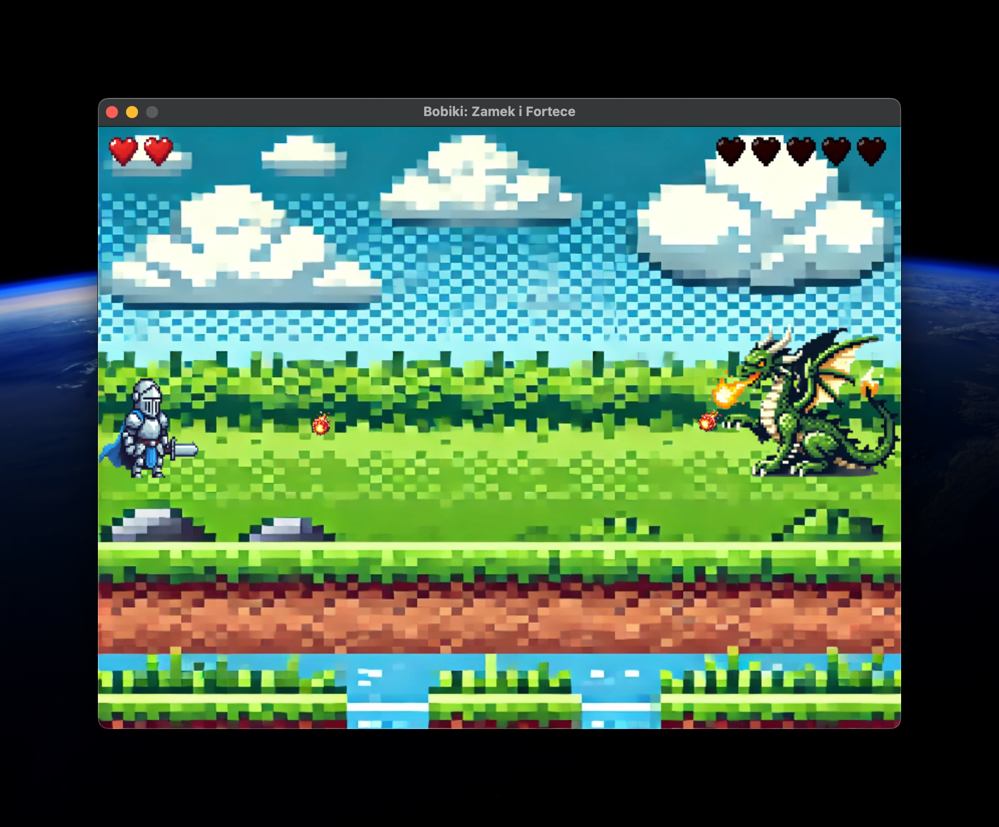

# Bobiki: Zamek i Fortece

Bobiki: A simple game built using Pygame. In this game, players control a character named Bobiki, who must defeat a dragon to win the game.



## Features

- **Multiple Game Screen**: Includes welcome screen, exploration, game over, and victory screens.
- **Player and Enemy Mechanics**: Control Bobiki to move, fight the dragon, and avoid fireballs from the dragon.
- **Sound Effects and Music**: Background music and sound effects enhance the gaming experience.
- **Dynamic Graphics**: Rotating and moving sprites for player, enemies, and projectiles.

## Installation

1. **Clone the repository**:
   ```bash
   git clone https://github.com/yourusername/bobiki.git
   cd bobiki
   ```

2. **Install dependencies**:
   Ensure you have Python and Pygame installed. You can install Pygame using pip:
   ```bash
   poetry install 
   ```

3. **Run the game**:
   ```bash
   poetry run bobiki
   ```

## Game Controls

- **Arrow Keys**: Move Bobiki around the screen.
- **Spacebar**: Attack with a sword.
- **Mouse Click**: Interact with the welcome, game over, and victory screens.

## Game Phases

- **Welcome Screen**: Click to start the game.
- **Explore**: Navigate the world, avoid dragon fireballs, and prepare for battles.
- **Fight**: Engage with enemies and reduce their health.
- **Fortress Boss**: Battle against the fortress boss.
- **Castle Tasks**: Upgrade your weapon.
- **Game Over**: Restart the game after losing all lives.
- **Victory**: Celebrate your win after defeating the dragon.

## Assets

All game assets, including images and sounds, are located in the `assets` directory. Ensure this directory is present and correctly structured for the game to function properly.

## Contributing

Contributions are welcome. Especially for parents who want to help their children learn programming. Please fork the repository and submit a pull request with your changes.

## License

This project is licensed under the MIT License. See the [LICENSE](LICENSE) file for details.

## Acknowledgments

- Pygame for providing the framework to build this game.
- [Watch the game trailer on YouTube](https://www.youtube.com/watch?v=GOpmfKBN0RU)
